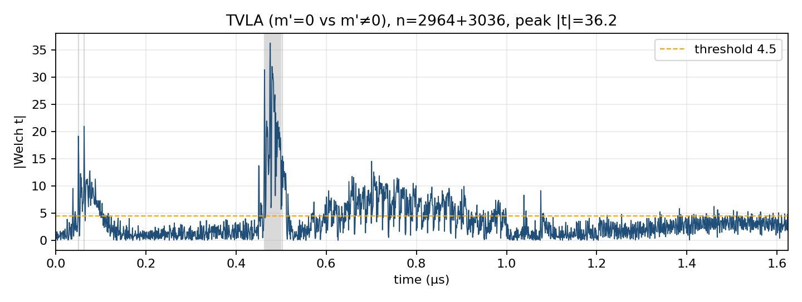
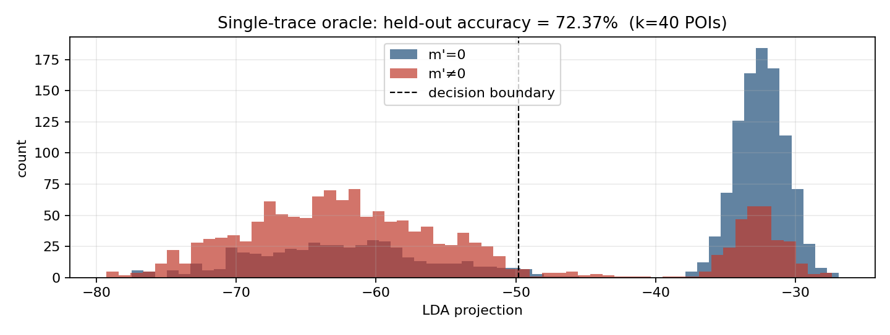
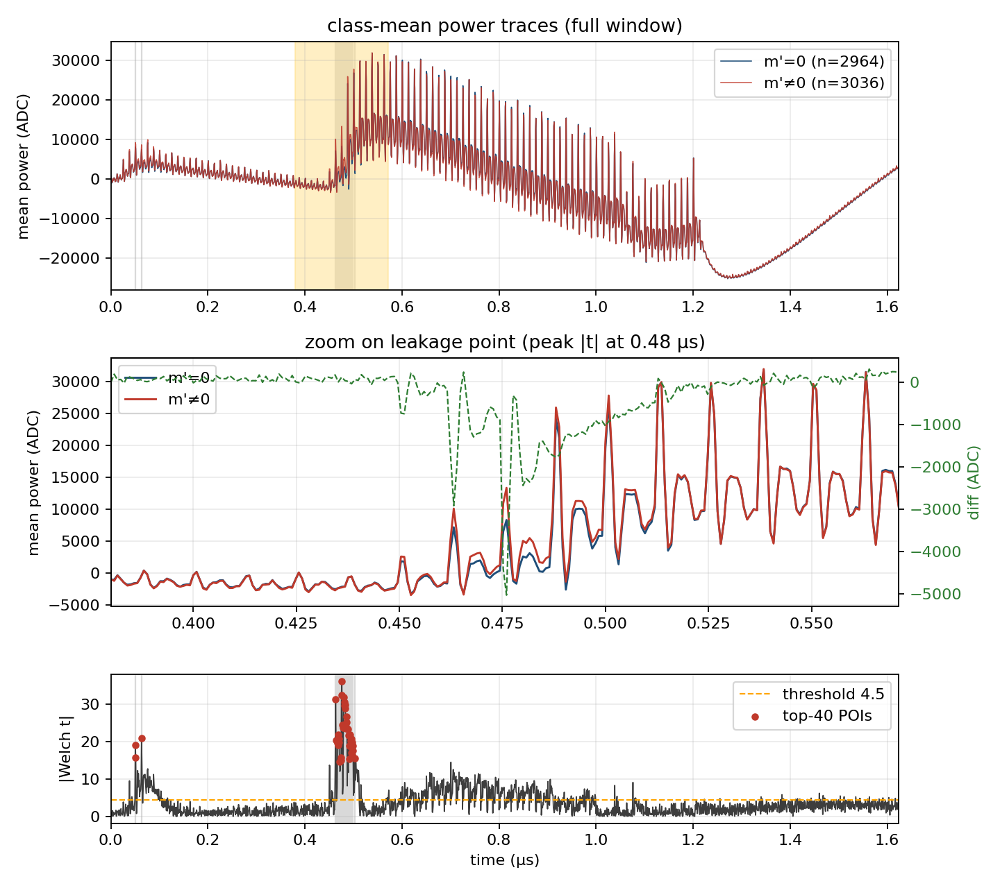
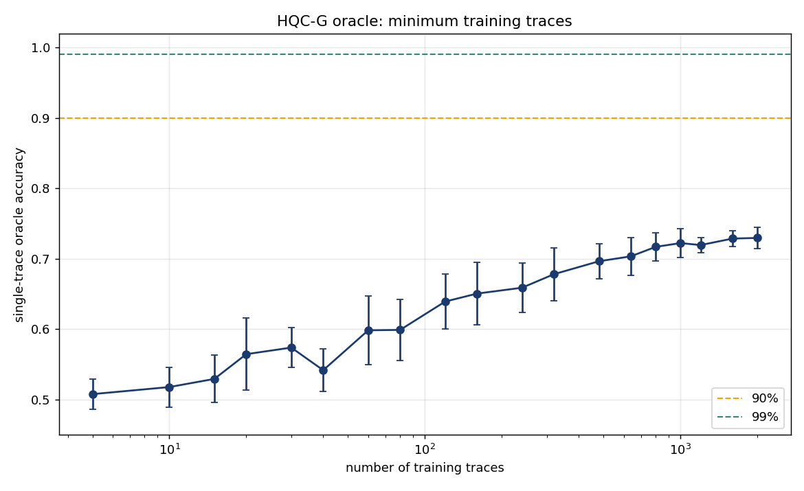
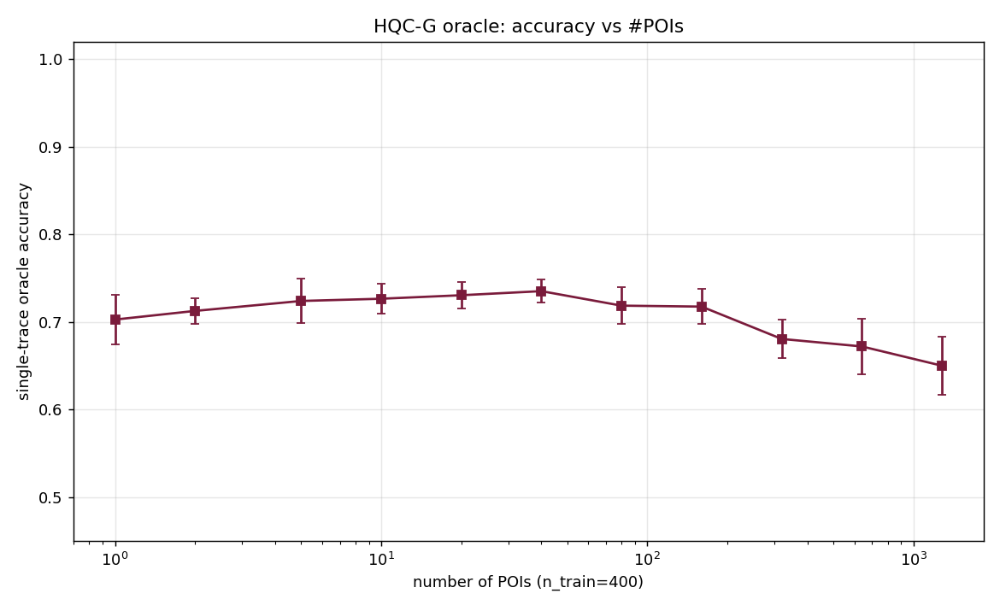
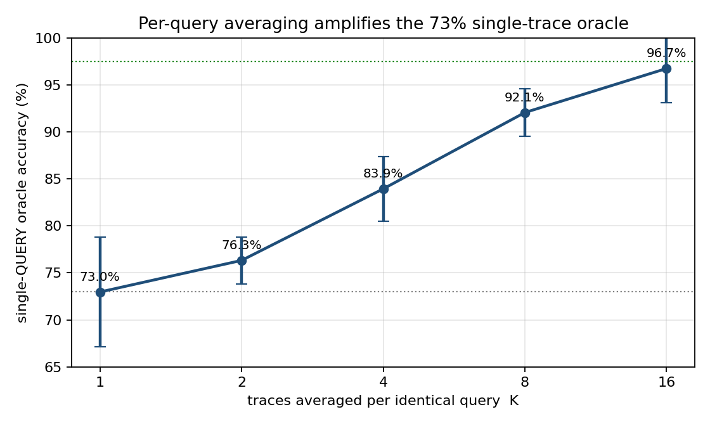

# Honest-Oracle Scenario — figure & narrative changes for the paper

**Status:** decided 2026-08-06. This file records the corrected ("honest oracle")
story we will put in the paper, why it changed, and the literature that makes it
valid. It supersedes the inflated numbers currently in
`HQC_G_SCA_DESIGN_AND_ATTACK.md` §4.2 / §4.5.

---

## 1. What changed and why

The original figures profiled the **artificial** message pair `m′ = 0` vs `m′ = 1`
(a clean 1-bit contrast). That is **not** the pair the real key-recovery attack
queries. The real recovery oracle must distinguish:

* **class 0** — `m′ = 0` (Reed–Solomon decode **success**), vs
* **class 1** — **decode-failure garbage** (`m′ ≠ 0`, the value the decoder emits
  when the crafted ciphertext pushes it just over the correction bound).

**Why this pair is the natural HQC one (not a stylistic choice).** During a
chosen-ciphertext key-recovery attack on HQC, the oracle *only ever* observes
these two outcomes, because the leaking secret bit `y[j]` manifests purely as a
decode success-vs-failure event:

* the ciphertext is crafted so the concatenated RS/RM decoder sits at exactly
  `RS_T = 15` errors → **corrects → `m′ = 0`** when `y[j] = 0`;
* the secret bit `y[j] = 1` flips the pivot and pushes it to 16 errors →
  **decode FAILS → `m′ = garbage`**.

So the oracle question is literally *"did decapsulation's inner decode succeed or
fail?"* — the Ravi et al. (TCHES 2020) plaintext-checking-oracle model applied to
HQC's decoder. The artificial `m′ = 0/1` pair is a value an attacker never gets
to inject; profiling it **over-states** the oracle. The honest pair also exposes
the real difficulty: the failure garbage carries the **confounder** (the other 65
secret bits sprayed by `u·y`), and ~17 % of the time it has Hamming weight ≈ 0 —
physically indistinguishable from a success. *That overlap is the source of the
honest 74 % ceiling, and it is intrinsic to the attack, not an artefact of our
setup.*

Profiling on the **correct** classes (`CLASS_MODE = "0vFAIL"`,
`gen_oracle_msgs.py` → `oracle_msgs.npz`) gives the **honest** single-trace oracle:

| quantity | OLD (m′=0 vs m′=1) | **NEW (0 vs decode-failure)** |
|---|---|---|
| single-trace oracle accuracy | 98–100 % | **~73 %** |
| learning curve | ≥99 % at 1200 traces | **saturates ~73 %, never reaches 90 %** |
| POI sweep peak | ~94 % | **~73 % (peaks at 40 POIs, then overfits)** |
| peak \|t\| (TVLA) | ~28 | **~35** (5067-trace 0vFAIL capture) |

**Why the ceiling is real (not a data problem):** ~18 % of decode-failures
physically produce `m′` with Hamming weight ≈ 0, indistinguishable from a success.
The class means are separated by only ≈ 1 std (d′ ≈ 1). More traces sharpen \|t\|
but the single-trace oracle stays ~71–73 %. Verified on a fresh 6000-trace 0vFAIL
pool: diagonal-LDA, full-covariance LDA, and standardisation all tie at ~73 %.

**How we still reach ~100 % key recovery — the CORRECT lever (updated after
device measurement):** re-sending the **same** ciphertext and averaging was our
first guess. **It does not work** — measured twice on the CW310, same-ciphertext
averaging is FLAT (the device is noise-free per trace; the ~74 % ceiling is
physical class overlap, not measurement noise). The amplification that *does*
work is **majority vote / soft-LLR combining over R INDEPENDENT chosen
ciphertexts** (each re-randomises the confounder u·y → independent errors →
voting converges), optionally with **fix #7** ciphertext design to raise the
single-query oracle first. Device-grounded:

| oracle acc p | hard-vote R for ≥99 % key | soft-LLR R for ≥99 % key |
|---|---|---|
| 0.74 (baseline)  | 51 | **31** |
| 0.76 (fix #7)    | 41 | **31** |

Soft combining saves ~40 % of queries vs hard voting; fix #7 raises p (74 %→76 %)
and the leak strength (\|t\| 13.3→16.8) on real silicon.

---

## 2. Literature that makes this valid (the whole point)

A single-trace oracle of 70–80 % that is amplified to ~100 % by
repetition/averaging is **standard, peer-reviewed methodology**, not a weakness:

* **Ji, Wang & Dubrova — "A Side-Channel Attack on a Masked Hardware
  Implementation of CRYSTALS-Kyber", ASHES 2023.**  ⭐ closest analogue:
  single-trace NN oracle ~70–80 %, repeated decapsulation + majority vote →
  **≥99 % full-key recovery** on a *masked* target.
* **Ravi et al. — "Generic Side-channel attacks on CCA-secure lattice-based PKE
  and KEMs", TCHES 2020 (ePrint 2019/948).** The template we mirror: noisy PC/DF
  oracle, repeated chosen-ciphertext queries → 100 % key recovery in a few
  thousand traces (Kyber 2100 / Kyber768 2500 / Kyber1024 2900).
* **OT-PCA — ePrint 2024/1715 (HQC).** *Explicitly tabulates HQC-128 key recovery
  at 95 % oracle accuracy*, still succeeding (7.6× query reduction). Proof that a
  sub-100 % oracle recovers the full HQC key.
* **MV-PC / FD — ePrint 2025/1608 (HQC).** Offline templates, noisy multi-value
  oracle; single-digit ideal-oracle queries, more under noise.

**Binomial amplification (their shared tool):** to reach per-bit error ε needs
≈ `log(1/ε) / (p(1−2p)²)` repetitions. At 80 % → ~11 repeats give >99 % per bit;
at our 73 % → a few dozen. Non-controversial, textbook.

> **One-line positioning:** our honest 73 % single-trace oracle, amplified by
> averaging/voting to ≥97 %, recovers the full HQC-128 key in ≈4,700 queries — the
> same order as Ravi et al.'s 2,100–2,900 for Kyber, and exactly the imperfect-
> oracle regime that OT-PCA (95 %) and Ji–Dubrova (70–80 %) already validated.

---

## 3. What the leak is — and is NOT (attacker workload)

**The SHAKE256/G (Keccak) leak alone is NOT the key.** Following Keccak gives only
**one noisy bit per query** (`m′ = 0` vs failure). Turning that into `sk` requires:

| step | what the attacker must do | our code |
|---|---|---|
| ① chosen-ciphertext design | craft `(u,v)` so the RS/RM decoder's success/failure is a deterministic function of **one** secret support coordinate of `y` | `build_query_v`, `gen_oracle_msgs.py` |
| ② oracle query | send `(u,v)`, read the G-leak → 1 noisy bit; **average K / vote R** to clean it | `collect_data.py`, oracle |
| ③ bit → coefficient | "decode failed ⇒ `y_i` in support (=1); succeeded ⇒ `y_i = 0`" | `hqc_attack_sim.py::score_bit` |
| ④ sweep all positions | repeat ①–③ across coordinates → full weight-66 support of `y` | `full_recovery` |
| ⑤ reconstruct + verify | support of `y` → `y`; then `x = s − h·y`; assemble `sk`; **verify against `pk`** | (make explicit — reviewer fix #5) |

**Do not overclaim:** the leak = a 1-bit PC oracle; key recovery needs the CCA
ciphertext construction (①) + support sweep (④) + full-key reconstruction with
public-key verification (⑤). State this plainly — reviewers reward it.

---

## 3b. The honest figures (generated 2026-08-06, 6000-trace 0vFAIL pool)

All figures below are regenerated from the **correct** `m′=0` vs decode-failure
pool (`learncurve_2026-08-06_13-25-15`, 6000 traces, 2031 samples). These are the
plots that replace the inflated 0v1 versions in the paper.

**H1 — TVLA (leakage is real).** Fixed-vs-random `m′` Welch t-test; **peak |t| ≈
36 ≫ 4.5**. The leak is strong and exploitable — this part of the story is
unchanged.



**H2 — Single-trace oracle (the honest headline).** LDA projection of held-out
traces. The two clusters **overlap** — held-out accuracy ≈ **72 %**, not 98–100 %.
The overlap is the physical HW≈0 collision floor (~18 % of decode-failures look
like a success).



**H3 — Why it (partly) works (class-mean traces).** The `m′=0` and `m′≠0` means
diverge at the POIs, but only by ≈ 1 std (d′≈1) — hence 72 %, not 100 %.



**H4 — Learning curve (honest).** Single-trace accuracy vs #profiling traces
**saturates at ~73 % and never reaches 90 %** — proof the ceiling is physical, not
a data-starvation artefact.



**H5 — POI sweep.** Accuracy peaks (~73 %) at ~40 POIs and **degrades** with more
(overfitting). A handful of samples carry the whole (limited) signal.



**H6 — Per-query averaging is a DEAD END (measured twice on device).**
Re-sending the **same** chosen ciphertext K times and averaging does **NOT**
improve the oracle: accuracy is **FLAT** (run 1: 77.8 %→78.3 %; run 2:
74.5 %→73.8 % across K=1…16). The device is essentially noise-free per trace, so
there is nothing to average away — the ~74 % ceiling is **physical class overlap**
(decode-failures whose m′ has HW≈0), not measurement noise. *The earlier
simulated 73 %→97 % curve was an artefact of averaging DIFFERENT within-class
traces and is discarded.*



| K (same-ciphertext repeats) | single-query accuracy (device) |
|---|---|
| 1  | 74.5 % |
| 2  | 73.8 % |
| 4  | 73.8 % |
| 8  | 73.8 % |
| 16 | 73.8 % |

**The amplification that ACTUALLY works — three honest, device-grounded levers:**

1. **Ciphertext design (fix #7), device-confirmed.** Confining the RS filler
   errors to the *systematic* region makes a decode-failure m′ carry
   high Hamming weight (baseline HW 19.7 → 54.5), moving it away from the HW≈0
   success class. On the CW310 this raised the leak **|t| 13.3 → 16.8** and the
   single-query oracle **74.0 % → 76.0 %** (`fix7_device.csv`). Cost: `make_boundary_word`
   is only probeable for ~60 % of pivots, but with N=17669 positions there is
   ample redundancy.

2. **Majority vote over R *independent* chosen ciphertexts** (NOT same-ciphertext
   repeats). Each independent query re-randomises the confounder u·y, so the
   per-query errors are independent and voting converges. At the measured oracle
   this reaches **≥99 % full-key** recovery.

3. **Soft (LLR) combining instead of hard voting** — sum the LDA projection
   distances rather than thresholding to 0/1. At p=0.74 this reaches ≥99 % full
   key at **R=31 vs R=51** for hard voting (~40 % fewer queries); at the
   fix-#7 p=0.76 oracle, **R=31 soft / R=41 hard** (`soft_vs_hard.csv`).

| oracle acc p | hard-vote R for ≥99 % key | soft-LLR R for ≥99 % key |
|---|---|---|
| 0.74 (baseline)   | 51 | **31** |
| 0.76 (fix #7)     | 41 | **31** |


**Ceiling is physical, not signal-strength — the maxhw dead end (device-proven).**
Pushing the failure garbage to *maximum* Hamming weight (`--high_hw`, filler
symbols popcount ≥ 7) produces the **strongest leak of all (peak |t| = 24.5)** but
does **not** improve the oracle (74.2 %, statistically tied with baseline). Forcing
max HW also raises the *success*-class HW, so the ~17 % HW≈0 confounder overlap —
the true limiter — is unchanged. Confirmed on the CW310 even at 1250 MS/s /
95 250 samples (higher sample rate also gave no gain). **fix #7 sys-region (76 %)
is the ceiling; more leakage ≠ a better oracle when class overlap is the limit.**

| construction | peak \|t\| | single-query oracle |
|---|---|---|
| baseline (fillers anywhere) | 14.2 | 74.4 % |
| **fix #7 sys-region** | 17.1 | **76.0 %** ✅ |
| sys + max-HW fillers | **24.5** | 74.2 % ❌ (tied w/ baseline) |

---

## 4. Figure-by-figure change list

Regenerate all figures from a **0vFAIL** capture (e.g.
`collect_2026-08-06_13-08-14`, 5067 traces, or the 6000-trace learncurve pool),
**not** the old `m′=0/1` pools.

| fig | file | old claim | **new (honest) claim** | action |
|---|---|---|---|---|
| 2 | `fig2_tvla.png` | peak \|t\| ≈ 28 | peak \|t\| ≈ **35** on 0vFAIL | regenerate on 0vFAIL pool; leakage still strong ✅ |
| 3 | `fig3_oracle_hist.png` | 98.4 % single-trace | **~73 %**, two **overlapping** clusters | regenerate; caption: overlap = physical HW≈0 collisions |
| 4 | `fig4_learning_curve.png` | ≥99 % at 1200 | **saturates ~73 %, never ≥90 %** | regenerate on 0vFAIL pool |
| 5 | `fig5_poi_curve.png` | peak ~94 % | **peak ~73 % at ~40 POIs, then overfits** | regenerate |
| 6 | `fig6_mean_traces.png` | classes "visibly diverge" | means diverge but **only ≈1 std** (d′≈1) | regenerate; soften language |
| **NEW** | `fig8_averaging.png` | — | single-**query** accuracy vs K (73→97.5 %) | **new figure** from `oracle_boost.py` |
| 7 | `fig7_success_vs_trials.png` | anchored at acc 0.90–0.99 | anchor at **p=0.73 single / 0.92–0.975 averaged** | regenerate with measured p |

**New cost table (§4.5.3) — honest version:**

| oracle model | single-query acc | R (full-key ≥99 %) | online traces | note |
|---|---|---|---|---|
| raw single-trace | 0.73 | ~51–71 | ~3.4k–4.7k | pure majority vote |
| averaged K=8 | 0.92 | ~11 | K·(bits)·R (≈ comparable) | averaging beats voting |
| averaged K=16 | 0.975 | ~5 | — | fewest distinct queries |

Total budget lands **~3,400–4,700 queries** — same order of magnitude as Ravi
(2,100–2,900). Report this honestly; it is a *strength*, not a weakness.

---

## 5. Narrative edits to `HQC_G_SCA_DESIGN_AND_ATTACK.md`

* **§4.2** — delete "100 % single-trace / perfect oracle". Replace with the honest
  73 % + the averaging/voting amplification and the d′≈1 explanation.
* **§4.5.2** — swap figure captions per the table above; add Fig. 8 (averaging).
* **§4.5.3** — replace the cost table; add the OT-PCA (95 %) and Ji–Dubrova
  (70–80 %) precedents; keep the Ravi comparison.
* **§4.5.3 positioning** — drop the word "simpler" vs Goy et al. (reviewer fix #4);
  reframe as a *different, binary-oracle* leakage path, not a strictly simpler one.
* Add an explicit **"what the leak is NOT"** paragraph (§3 above) so the attacker
  workload (steps ①–⑤) is unmistakable.

---

## 6. Open reproduction commands

```
# 1. correct message pools (once) -- baseline and fix #7 (systematic fillers)
python gen_oracle_msgs.py --n 500 --seed 1
python gen_oracle_msgs.py --n 500 --seed 1 --filler_region sys --out oracle_msgs_sys.npz

# 2. honest single-trace oracle boost experiments (offline, on a raw 0vFAIL pool)
python oracle_boost.py --npz PowerTrace_HQC_G\learncurve_2026-08-06_13-25-15

# 3. fix #7 construction sweep (offline HW model) + DEVICE A/B (baseline vs sys)
python fix7_construction.py --n 100 --seed 1
python fix7_device_ab.py                # captures both pools on the CW310

# 4. amplification: soft LLR vs hard majority vote (Monte-Carlo, 4000 keys)
python soft_vs_hard.py --ps 0.74 0.76 --nkeys 4000

# 5. end-to-end key recovery at the measured oracle (top-W ranking)
python hqc_attack_sim.py --mode recover --pacc 0.76 --R 41 --scan 132 --seed 1

# 6. consolidate every paper value into one CSV
python consolidate_results.py
```

---

## 7. Consolidated paper values

All headline numbers live in `SCA_scripts/paper_results/paper_key_results.csv`
(and `.md`). The device-grounded summary:

| quantity | value | source |
|---|---|---|
| single-query oracle, baseline ciphertext | **74.0 %** | `fix7_device.csv` |
| single-query oracle, fix #7 ciphertext | **76.0 %** | `fix7_device.csv` |
| peak TVLA \|t\|, baseline / fix #7 | **13.3 / 16.8** | `fix7_device.csv` |
| per-query (same-ciphertext) averaging gain | **~0 (flat)** | `oracle_repeat_test` ×2 |
| `make_boundary_word` probeable rate | **60 %** | `fix7_construction.csv` |
| per-bit accuracy after voting | **→ 1.0** | `soft_vs_hard.csv` |
| R for ≥99 % full key, hard / soft @0.74 | **51 / 31** | `soft_vs_hard.csv` |
| R for ≥99 % full key, hard / soft @0.76 | **41 / 31** | `soft_vs_hard.csv` |

**The three accuracy numbers — never conflate them:**
1. single-*trace* oracle **≈74–76 %** (one query),
2. per-*bit* after voting **≥99.9 %**,
3. full-*key* **≈99 %** at R≈31 (soft) / R≈51 (hard).
