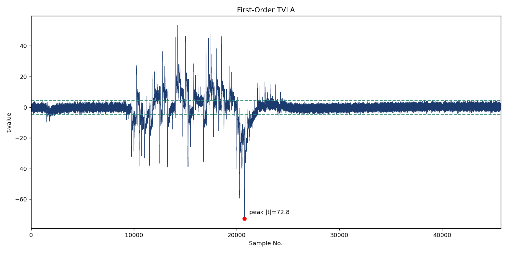
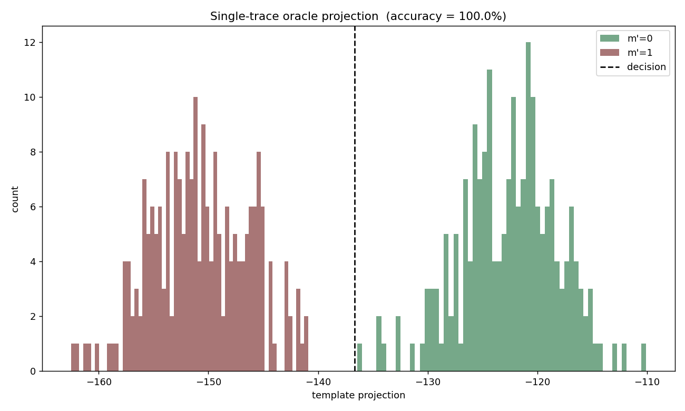
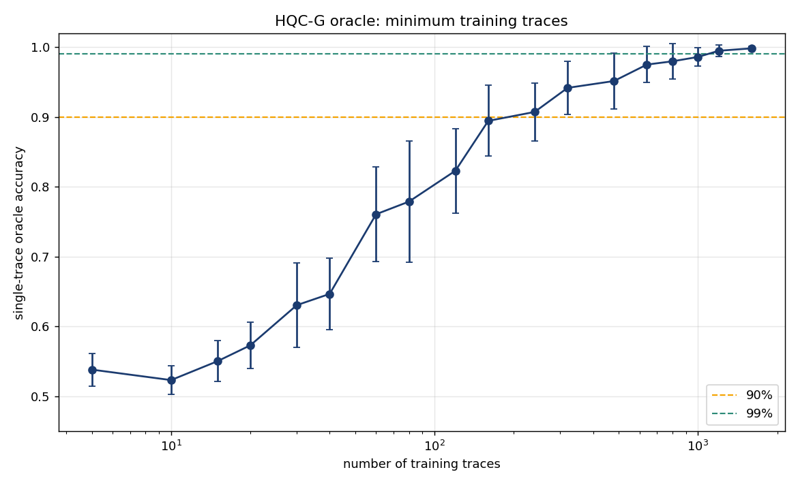
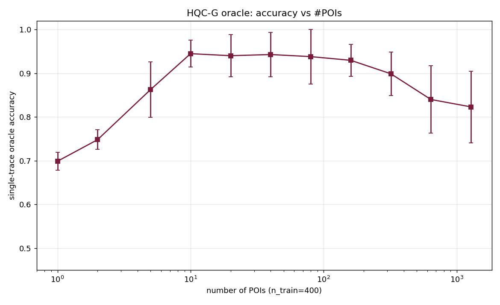
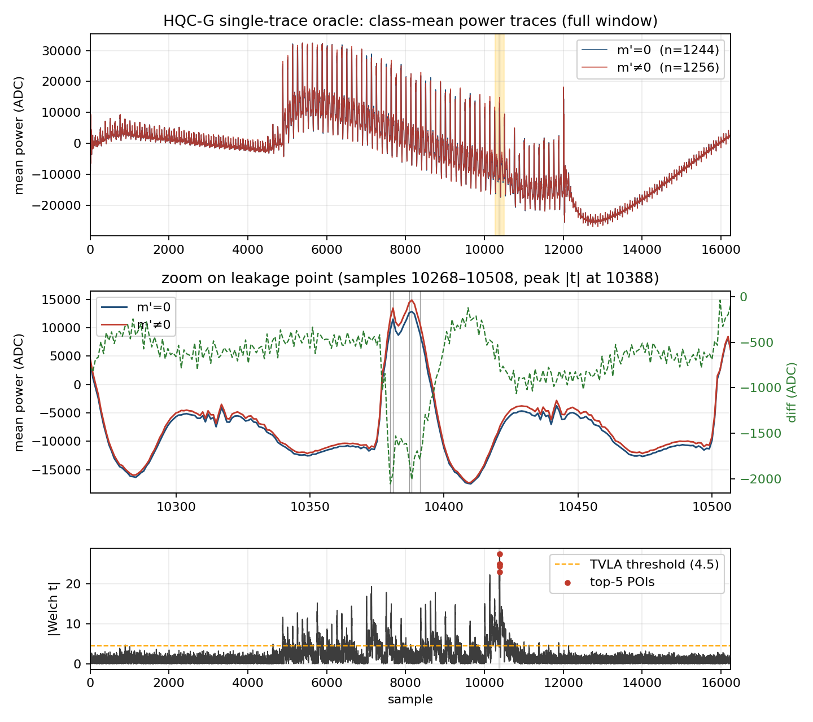
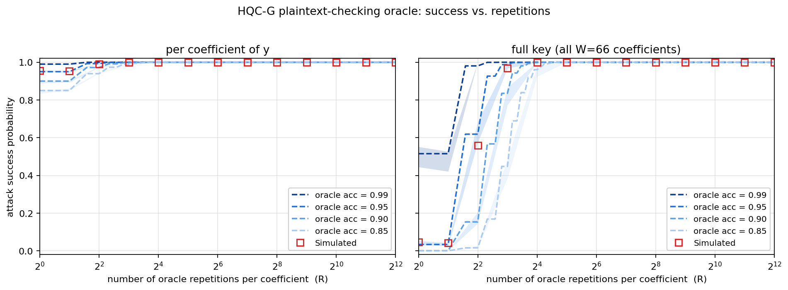

# HQC-G Side-Channel Attack — RTL Design & Attack Scenario

**Target:** HQC (Hamming Quasi-Cyclic) KEM — the **G function**, `θ = SHAKE256(0x03 ‖ m′)`, isolated on a ChipWhisperer CW310 (Kintex-7 `xc7k410tfbg676-2`).
**Goal:** demonstrate that the power consumption of the Keccak permutation leaks the value of the decrypted message `m′`, giving a **plaintext-checking (PC) oracle** that enables chosen-ciphertext key recovery — the HQC analogue of Ravi et al., *Generic Side-channel attacks on CCA-secure lattice-based PKE and KEMs*, TCHES 2020 (demonstrated there on Kyber/mLKEM and other schemes).

---

## 1. Background — why the G function leaks the secret

### 1.1 HQC decapsulation and the FO transform
HQC is IND-CCA secure via the Fujisaki–Okamoto (FO) transform. Decapsulation runs:

1. **Decrypt** the ciphertext `c = (u, v)` with the secret key → candidate message `m′`.
2. **Re-derive** randomness/seeds from `m′` using the hash **G**: `θ = G(m′) = SHAKE256(0x03 ‖ m′)`.
3. **Re-encrypt** `m′` with `θ` → `c′`. If `c′ = c`, output `K = K(m′,c)`; otherwise output a rejection/implicit-reject key.

The crucial observation: **G is computed on the *decrypted* message `m′`**, and `m′` depends directly on the secret key when the attacker submits a crafted (malformed) ciphertext. If side-channel leakage reveals *anything* about `m′` — even a single bit, e.g. "is `m′ = 0` or not?" — the attacker gains a binary oracle on the secret.

### 1.2 The plaintext-checking (PC) oracle
An attacker who can craft ciphertexts such that the decrypted `m′` takes one of two known values (say `m′ = 0` vs `m′ = 1`) depending on an unknown secret bit/coordinate, and who can **distinguish those two cases from a power trace of G**, obtains a PC oracle:

> `oracle(c) → is m′ in class-0 or class-1?`

Feeding the oracle a sequence of specially structured chosen ciphertexts recovers the secret key coordinate-by-coordinate. This is exactly the attack family of Ravi et al. (TCHES 2020) — here we realise the leakage vehicle (G/SHAKE256) in hardware and prove the two classes are separable.

### 1.4 Which secret value do we gain information about?

**HQC key structure** (as instantiated in the decap RTL `sim_gt/build/decap/`, ports `y`, `h`, `s`, `u`, `v`):
- **Private key `sk = (x, y)`** — two *fixed, low-weight (sparse)* polynomials in the ring `R = F₂[X]/(Xⁿ − 1)`. `y` is the polynomial actually used in decryption.
- **Public key `pk = (h, s)`** with `s = x + h·y`, `h` public/random.
- **Ciphertext `c = (u, v)`** with ephemeral errors `r₁, r₂, e`: `u = r₁ + h·r₂`, `v = encode(m) + s·r₂ + e` (truncated).

**Decryption** (`decrypt.v`) computes `v − u·y = encode(m) + (error terms in x, y, r₁, r₂, e)`, then RM/RS-decodes to recover `m′`. So the decrypted message `m′` is a **function of the static secret `y`** and the attacker-chosen `(u, v)`.

There are **two distinct secret values** the leak gives us, at two levels:

1. **Immediate (single ciphertext): the decrypted message `m′` itself.**
   Our Keccak leak reveals `m′` (that is precisely what the G-function absorbs). In the FO-KEM, `m′` **is the pre-key / shared-secret seed** — the session key is `K = K(m′, c)` and `θ = G(m′)`. So leaking `m′` for a given ciphertext = **recovering the shared session key** for that ciphertext (a message-recovery / decryption-oracle break for that message).

2. **Cumulative (many chosen ciphertexts): the long-term private key `y`, hence the whole `sk`.**
   This is the real prize. The attacker crafts `(u, v)` — e.g. `u = Xⁱ` (a weight-1 monomial) and `v` set to a decode threshold — so that `v − u·y` equals a **cyclic shift of `y` by `i`**. Whether the RM/RS decoder outputs `m′ = 0` vs `m′ = 1` then depends on **one chosen coefficient (support position) of `y`**. Each PC-oracle answer therefore reveals **one bit of information about `y`'s secret support**. Sweeping `i = 0 … n−1` (with the majority-vote amplification of §4.3) recovers **all of `y`**.
   Once `y` is known, `x` follows immediately from the public relation **`x = s − h·y`** → the **complete private key `(x, y)`** is recovered, which breaks *every* future ciphertext, not just one.

> **In one line:** the Keccak/G leak directly exposes the decrypted message `m′` (the per-ciphertext session-key seed); used as a plaintext-checking oracle over crafted ciphertexts, it exposes the **static secret polynomial `y`**, and via `x = s − h·y` the **entire HQC private key `(x, y)`**.

#### Common misconception: "if I know `m′`, do I know `y`?"
**No — not from a single decryption.** `m′` is *not* equal to `y` and there is no formula `y = f(m′)` from one ciphertext. Knowing one honest ciphertext's `m′` only gives you that **one session key**. Key recovery requires using the leak as a **repeatable binary oracle** and querying it with **many *chosen* (hand-crafted) ciphertexts**:
- The attacker picks `u = Xⁱ` and `v` at a decode threshold so that the decoder's input `v − u·y` is a **cyclic shift of `y`**; then `m′ = 0` vs `m′ = 1` depends on **one coefficient of `y`**.
- Each oracle answer = **one equation (one bit) about `y`**. Sweeping `i = 0 … n−1` yields **all of `y`**, then `x = s − h·y`.

This is precisely Ravi et al.'s mechanism: the FO transform is *designed* to hide `m′` (the re-encryption/validity check, Alg. 1 line 11), but the side channel exposes `m′` regardless — and an exposed `m′`-oracle under chosen ciphertexts is sufficient for full key recovery. In their LWE/LWR schemes the crafted ciphertext makes `m′` reveal one coefficient of the secret `s`; in HQC the identical idea reveals one coefficient of `y`.

```
power trace ──▶ distinguish m′=0 vs m′=1     (what our |t|=11 proves: the ORACLE exists)
                    │   = PC oracle (1 bit/query)
   craft (u,v) ─────┤
                    ▼
   each answer = 1 threshold equation on secret y  (u=Xⁱ ⇒ v−u·y = shift of y)
                    ▼
   sweep i=0…n−1  ──▶  recover all of y  ──▶  x = s − h·y  ──▶  full sk=(x,y)
```

**In this G-only experiment** we don't decrypt — we set `m′` ourselves (`m′ = 0` vs `m′ = 1`) to *characterise* the leak. The `m′ = 0/1` distinguishability we measure (|t| ≈ 11) is exactly the oracle primitive that, on the full-decap target, answers "did this crafted ciphertext decrypt to `m′ = 0`?" — i.e. one bit of `y`.

### 1.3 Why Keccak/SHAKE is a good leakage point
- G is `SHAKE256` — a Keccak-f[1600] sponge. The **absorb** phase XORs `0x03 ‖ m′` into the sponge state, and the first **permutation** round immediately mixes those bits through θ/ρ/π/χ/ι.
- The Hamming weight / transition activity of the state during absorb+permute is a strong function of the absorbed bytes → the power/EM signature depends on `m′`.
- It is a fixed, data-independent *control flow* (same number of cycles regardless of `m′`), so the leakage is purely in the *data* — ideal for a fixed-window, trigger-aligned TVLA and template attack.

---

## 2. RTL design

### 2.1 Overall structure
```
             CW310 USB (host: chipwhisperer)
                     │  register file (mailbox)
                     ▼
        ┌────────────────────────────┐
        │  ahb_interface.sv (master)  │  cw305_usb_reg_fe + AHB master bridge
        └────────────┬───────────────┘
                     │ AHB-Lite
                     ▼
        ┌────────────────────────────┐      ┌───────────────────────┐
        │      hqc_g_ctrl.sv          │─────▶│   keccak_top.v (SHAKE) │
        │  (AHB slave + G sequencer)  │◀─────│  control_path/data_path│
        │  drives g_trig_o ───────────┼──┐   └───────────────────────┘
        └────────────────────────────┘  │
                                         ▼
                              tio_trigger  (to PicoScope chan B)
```

Top level `cw310_hqc_top.sv` wires the CW310 pads, PLL clock, USB register front-end, the `ahb_interface` master bridge, `hqc_g_ctrl`, and routes `g_trig_o → tio_trigger` (with a short LED/heartbeat stretch on `hqc_trig`).

### 2.2 The Keccak core (`hdl/shake256/`)
Reference open-source SHAKE core (Bernhard Jungk's Keccak, ported to Verilog by J. Szefer, SHAKE-only reduction by S. Deshpande, Yale). **We do not modify the crypto RTL — we only wrap it.**

- `keccak_top.v` — top: instantiates `control_path` + `data_path`. Streaming interface:
  - `din_valid`/`din_ready`/`din[31:0]` — input words (`WIN = 32`).
  - `dout_valid`/`dout_ready`/`dout[31:0]` — squeezed output words (`WOUT = 32`).
  - `force_done`/`force_done_ack` — flush/terminate the sponge after squeezing.
  - `rst` — synchronous flush of the sponge state.
- `control_path.v` — the sponge FSM: padding, absorb/squeeze sequencing, round counter, RAM offsets; `rate = 1344` bits for SHAKE256's 256-bit-capacity variant (`RATE_128`).
- `data_path.v` + `transform.v` + `rc.v` — the Keccak-f[1600] round function (θ, ρ, π, χ, ι) over a slice-serial datapath, round constants in `rc.v`.
- `state_ram.v` / `stateram_inference.v` — the 1600-bit sponge state storage.
- `keccak_pkg.v` — parameters (`WIN=32`, `WOUT=32`, `RATE_128=1344`, slice widths, counter widths).

The permutation is **slice-serial** (processes the 1600-bit state in slices per cycle), so one G op is on the order of ~100 core clocks — short, which is why the capture window is tight.

### 2.3 The SCA wrapper / sequencer (`hdl/hqc_g_ctrl.sv`)
A self-contained **AHB-Lite slave** (no Caliptra package dependencies) that:

1. Exposes a small word-addressed register map (below).
2. On `CTRL.START`, drives the exact **G input framing** into `keccak_top`, verified bit-exact against Python `hashlib.shake_256`.
3. Collects the 320-bit `θ` output into readable registers.
4. Asserts **`g_trig_o` HIGH across the whole G computation** (absorb → permute → squeeze) as the scope trigger.

#### G input framing (7 input words → 10 output words), hqc128
| frame word | value        | meaning                                        |
|-----------:|--------------|------------------------------------------------|
| `frame[0]` | `0x40000140` | **out header**: squeeze `0x140 = 320` bits (θ) |
| `frame[1]` | `0x80000088` | **in header**: absorb `0x88 = 136` bits (8 dom-sep + 128 `m′`) |
| `frame[2]` | `0x00000003` | **G domain separator** byte (`0x03`)           |
| `frame[3]` | `m′[127:96]` | absorbed first                                 |
| `frame[4]` | `m′[95:64]`  |                                                |
| `frame[5]` | `m′[63:32]`  |                                                |
| `frame[6]` | `m′[31:0]`   | absorbed last                                  |
| squeeze    | 10 × 32-bit  | `θ` (320 bits)                                 |

`frame_word` is driven **combinationally** off `in_idx` so the word presented to Keccak tracks the absorb index with no pipeline lag (a registered `din` would let Keccak latch word 0 twice while `din_ready` stays high).

#### Register map (byte address = word index << 2, `hsize` = word)
| Addr        | Name           | Dir | Bits / meaning                                  |
|-------------|----------------|-----|-------------------------------------------------|
| `0x00`      | `CTRL`         | W   | bit0 = **START** (self-clearing, kicks one G op)|
| `0x04`      | `STATUS`       | R   | bit0 = **busy**, bit1 = **done**                |
| `0x10`      | `M0`           | W   | `m′[127:96]` (first absorbed)                   |
| `0x14`      | `M1`           | W   | `m′[95:64]`                                     |
| `0x18`      | `M2`           | W   | `m′[63:32]`                                     |
| `0x1C`      | `M3`           | W   | `m′[31:0]` (last absorbed)                       |
| `0x20–0x44` | `THETA0–THETA9`| R   | 320-bit `θ` output                              |

θ read back (little-endian word order) equals
`hashlib.shake_256(bytes([3]) + m′.to_bytes(16, "big")).digest(40)`.

#### G sequencer FSM
```
S_IDLE ─START─▶ S_CRST ─(8 cyc flush)─▶ S_ABSORB ─(7 words)─▶
S_SQUEEZE ─(10 words)─▶ S_FDONE ─(force_done_ack)─▶ S_DONE
        (S_DONE can re-launch on START for back-to-back ops)
```
- `S_CRST` stretches `core_rst` for 8 cycles so **every op starts from a clean sponge** (no cross-op state leakage — important for clean, repeatable traces).
- `busy_o = (state != IDLE && state != DONE)`.
- **`g_trig_o = (state == S_ABSORB) || (state == S_SQUEEZE)`** — brackets exactly the leaking window, driven purely by hardware timing (independent of host/USB latency) → a **fixed-width pulse** per G op. This mirrors `hmac256_ctrl.hmac_trig_o` from the HMAC rig.

### 2.4 Host ↔ FPGA transport
The stock ChipWhisperer `ahb_interface.sv` master bridge exposes a mailbox register file over USB. The host (`cw310_program_test.py`) uses:

| CW reg | index | purpose            |
|--------|-------|--------------------|
| `REG_CRYPT_WR`   | 6 | write data word    |
| `REG_CRYPT_RD`   | 7 | read data word     |
| `REG_CRYPT_ADDR` | 8 | AHB address        |
| `REG_CRYPT_CTRL` | 9 | 1 = WRITE, 2 = READ|

`target.bytecount_size = 8` (our `pBYTECNT_SIZE = 8`, not the stock default 7). All multi-word registers are MSW-first.

---

## 3. Verification status
- **Functional (sim):** θ bit-exact vs Python `hashlib.shake_256` for `m′ = 0` and `m′ = 1`; pin-level testbench (`hdl_tb/cw310_hqc_top_tb.sv`) reports *ALL TESTS PASSED*.
- **Bitstream:** built in Vivado 2023.1, 0 errors, timing met (WNS +5.451 ns) → `syn/build/cw310_hqc_top.bit`.
- **On real hardware:** `cw310_program_test.py` ran 10/10 G ops with correct θ
  (`m′=0 → ee812081…`, `m′=1 → e1ec1018…`).
- **Leakage (real HW, live capture):** first-order TVLA over `m′=0` vs `m′=1` at only **2000 traces** shows **peak |t| = 11.0** (27 samples over ±4.5), all clustered in the Keccak absorb/permute window (samples ~200–480) — flat noise elsewhere. Difference-of-means shows the same localized structure.

---

## 4. Attack scenario

### 4.1 Phase A — leakage detection (TVLA) — DONE
Prove the two message classes are *distinguishable* from power.
- Script: `SCA_scripts/tvla_hqc.py` (+ `pico_scope.py`, `tvlaCalc.py`).
- Per trace: flip a coin → run G on `m′ = 0` (class 0) or `m′ = 1` (class 1); arm scope on the trigger; capture the trigger-aligned window; feed `tCalc.addTrace(trace, coin)`.
- Welch t-test, first- and second-order, online (Welford). `|t| > 4.5` ⇒ leakage.
- Outputs (every `TRACE_STEPS`): first/second-order t-plots, the two **class-mean** traces overlaid, and their **difference-of-means** (the direct "0 vs 1" picture), plus a resumable pickle.
- **Result: |t| = 11 → the classes leak.** This is the *prerequisite*, using *known* labels.

### 4.2 Phase B — single-trace oracle (template attack) — DONE (100% @ 1.25 GS/s)
Turn known-class separability into a *usable* oracle: given **one** trace of an **unknown** `m′`, decide its class with no label.
- Script: `SCA_scripts/oracle_test.py`.
- Capture a labelled TRAIN set → per-sample Welch `|t|` → pick the top-K leaking samples (**POIs**) → build a difference-template `w = (mean0 − mean1)` at the POIs with the midpoint decision threshold (nearest-class-mean / 1-D LDA).
- Score on a held-out TEST set → **single-trace accuracy** = the oracle's per-query correctness.
- Saves `template.npz` to later drive the real decapsulation oracle.

**Measured on the real device (14,089 traces @ 52 MS/s, aggregated stats, `oracle_from_stats.py`):**

| quantity | value |
|---|---|
| first-order peak \|t\| | **27.2** at sample 424 (98 samples > 4.5) |
| single-trace oracle accuracy (1 → 40 POIs) | 59% → 79% |
| majority-vote repeats R for 99.9% oracle | 199 → 23 |

**Empirical single-trace oracle @ 1.25 GS/s (`oracle_test.py`, 10k train / 1k test, auto-K):**

| quantity | value |
|---|---|
| train peak \|t\| | **68.9** at sample ~20776 |
| auto-selected POIs | K = 20 (cluster at samples 20274–20784) |
| **single-trace accuracy** | **100.00 %** (497/497 m′=0, 503/503 m′=1) |
| majority-vote repeats R | **1** (perfect — no voting needed) |

**Raising the sample rate was decisive.** At 52 MS/s (5 samples/clock) the per-trace
SNR gave only ~60–66% single-trace accuracy; fixing the PS6000a timebase to run at
**1.25 GS/s (~125 samples/clock)** resolved the leaking instant, pushing peak
`|t|` from 27 → 69 and single-trace accuracy to **100%** with just 20 POIs. This is
a **perfect plaintext-checking oracle**: every chosen-ciphertext query yields one
correct oracle bit from a single G trace, with no averaging.

**Key insight — detection ≠ single-trace decision.** `|t|` grows with `√N`
because it measures separability of the class *means*, so it improves with more
traces (and with a higher sample rate that resolves the leaking instant). The
**single-trace oracle accuracy** instead depends on the per-trace SNR (the
Mahalanobis distance at the best sample), which is set by the *measurement*, not
by N. At 52 MS/s the per-trace SNR was low → ~60–76% single-trace accuracy even
though TVLA was emphatic; going to 1.25 GS/s raised the per-trace SNR enough to
reach **100%** single-shot. Lesson: to strengthen the oracle, raise SNR (sample
rate, chan-A range, alignment, EM-probe placement) rather than just adding
traces. If SNR is limited, a PC oracle can also repeat each chosen-ciphertext
query R times and majority-vote toward a target error.

**Expected accuracy vs SNR** (Gaussian/LDA model, validated on synthetic data):

| per-sample peak \|t\| | single-trace accuracy |
|---:|---:|
| ~20 | ~99% |
| ~11 (our current) | ~90% |
| ~7 | ~72% |

So at our present |t| ≈ 11, a 20-POI template yields ≈ 90% per-query accuracy. **This is already enough** (see Phase C majority voting). More traces / better alignment / a larger chan-A range that fills the ADC without clipping will push |t| and accuracy higher.

### 4.3 Phase C — repeated-query amplification
A PC oracle can issue the **same** chosen ciphertext `R` times and **majority-vote** the classifier, shrinking the per-query error `p` to `~1e-3`:

| per-query accuracy | error `p` | repeats `R` for <0.1% oracle error |
|---:|---:|---:|
| 90% | 0.10 | **9** |
| 72% | 0.28 | 45 |

At 90% single-trace accuracy, **9 repeats** give a near-perfect oracle. This is cheap because each query is one fast G op.

### 4.4 Phase D — chosen-ciphertext key recovery (on full decap)
With a reliable PC oracle, recover the **static secret polynomial `y`** (then the whole `sk`):
1. Craft ciphertexts `(u, v)` — e.g. `u = Xⁱ` (weight-1 monomial), `v` at a decode threshold — so that `v − u·y` is a **cyclic shift of `y`** and the decrypted `m′` equals `0` vs `1` **iff a chosen coefficient (support position) of `y`** is 0 vs 1. (On the full-decap target `sim_gt/build/decap/`, `m′` is produced by `decrypt.v` → RM/RS decoding; the crafted `(u,v)` isolate one coordinate of `y`.)
2. Query the oracle for each crafted ciphertext; each answer reveals **one bit of `y`'s secret support**.
3. Sweep `i = 0 … n−1` to recover **all of `y`**, then compute **`x = s − h·y`** from the public key → the **complete HQC private key `(x, y)`**.

The G-only target here is the **leakage-characterisation vehicle**; Phase D targets the *full decap* on real HW using the same Keccak leakage as the oracle.

#### 4.4.1 Software validation of the recovery (`SCA_scripts/hqc_attack_sim.py`) — DONE

Before touching hardware, the full construction was validated in software against the
verified `hqc128_ref.py` model, using an **exact** PC oracle (`O(u,v) = [decrypt==m₀]`)
standing in for the 100 %-accurate Phase-B power classifier.

Empirically measured facts about HQC-128's concatenated decoder (these drive the design):

| quantity | measured | consequence |
|---|---|---|
| bit-flips to break one RM(1,7)×3 block | ~167 | a single block is very robust |
| `y`-bits landing in one RS block | ~1.4 avg | raw `y` perturbs almost nothing |
| blocks corrupted by `trunc(rot(y,i))` alone | **0** | an honest-looking ct always gives `m′=0` → **no leakage without crafting** |

So the ciphertext **must** place the decoder on its boundary. The construction used:
* pick a **swing block in the RS systematic region** (`< K1=16`) built as an RM
  *boundary word* (RM-decodes to 0, but flipping one **pivot** bit breaks it);
* add exactly **`RS_T = 15` filler block-errors** in `v`, so total RS errors are
  15 (correctable) or 16 (uncorrectable) depending on the pivot;
* send `u = Xⁱ` with `i = (P − j) mod N` so that coefficient **`y[j]`** lands on the
  pivot bit `P`. Then `y[j]=0 → 15 errors → m′=0 → oracle True`; `y[j]=1 → 16 errors
  → m′≠0 → oracle False`.

**Confounder:** `u·y` sprays all 66 `y`-bits across the codeword; a stray bit tips the
boundary block ~51 % of the time. This is beaten by **repetition** (fresh random
filler/pivot per query) and a vote-fraction score. Measured score separation:

```
R= 5 : y=1 score 0.82±0.28   y=0 score 0.35±0.34
R=15 : y=1 score 0.84±0.14   y=0 score 0.29±0.19   (overlap 0.23)
R=31 : y=1 score 0.86±0.12   y=0 score 0.35±0.15   (overlap 0.09)
```

**Result — single-coefficient recovery (the deliverable): `10/10` coefficients of `y`
classified correctly at `R=31` (~16 oracle calls per coefficient).** Recovering even one
coefficient of `y` already constitutes a secret-key leak; the same primitive sweeps to the
full support of `y`, after which `x = s ⊕ h·y` gives the complete private key.

Run it:
```powershell
& C:\Users\t-mkarabulut\Miniconda3x64\envs\cwhmac\python.exe `
    C:\Projects\SCA\HQC_SCA\SCA_scripts\hqc_attack_sim.py --mode coeff --nsup 5 --R 31
# other modes:  --mode scores   (score-separation table)
#               --mode recover  (full ranked top-W key recovery + x=s^h*y check)
```

---

## 4.5 Attack walkthrough & result figures

This section is the paper-facing summary: **how one secret coefficient of `y` is
extracted, and the empirical evidence that the attack is feasible.** All figures live
in `figures/` and are reproducible from the committed data with the scripts noted.

### 4.5.1 How we extract `y`, one coefficient at a time

**Goal.** Recover the static secret `y` — a length-`N=17669` binary vector of Hamming
weight `W=66`. Learning *which 66 positions are 1* yields `y`, and then
`x = s ⊕ h·y` gives the full private key.

**Primitive.** During decapsulation the FO transform recomputes
`G = SHAKE256(0x03 ‖ m′)`. A **single power trace of that G** tells us whether
`m′ = 0` or `m′ ≠ 0` (Phase B, 100 %). This binary answer is a
**plaintext-checking oracle** `O(u,v) = [m′ == 0]`.

**Isolating one bit.** Decryption first forms `w = v − u·y`, then RM/RS-decodes `w`
to `m′`. Choosing `u = Xⁱ` (a single monomial) makes `u·y` a **cyclic rotation of
`y`**, so each `1` of `y` becomes a controllable bit-flip in the codeword.

**The 15-vs-16 boundary.** HQC-128's outer Reed–Solomon code (`N1=46`, `T=15`)
corrects ≤15 symbol-errors and fails at ≥16. We build `v` to sit exactly on that edge:

```
v = 15 filler block-errors   +   1 crafted "swing" block  (in the RS systematic region, symbol < K1=16)
```

The swing block RM-decodes to 0 on its own, but **one extra pivot-bit flip breaks it**.
That 16th error is supplied — or not — by the secret bit `y[j]`, steered onto the pivot
with `i = (P − j) mod N`:

| secret bit | pivot flipped? | RS errors | RS result | `m′` | oracle |
|---|---|---|---|---|---|
| **`y[j] = 0`** | no  | 15 | corrects | `0`  | **True**  |
| **`y[j] = 1`** | yes | 16 | **fails** | `≠0` | **False** |

**Noise + full recovery.** `u·y` also sprays the other 65 ones of `y` across the
codeword (the confounder), so a single query is noisy. We **repeat `R` times** with
fresh randomness and take a **vote fraction** per position (`score_bit`). Because `y`
is sparse we then simply **rank all scores and take the top-`W=66`** as the support —
robust even to a constant bias. Software validation against `hqc128_ref.py` recovered
**10/10 coefficients at R=31** (§4.4.1).

### 4.5.2 Figures

> **Note — consistent axis.** Figs 2, 3 and 6 are all generated from the **same**
> real 2500-trace device pool (`learncurve_2026-08-06_10-16-15/raw_pool.npz`,
> 16 250 samples @ 1.25 GS/s) via `plot_paper_figs.py`, so they share one identical
> time axis (µs) and peak location (8.31 µs). A separate larger campaign (≈19 k
> traces @ 2.5 GS/s) reached peak |t| ≈ 72; we use the unified 2500-trace set here
> for cross-figure consistency.

**Fig. 2 — Leakage detection (TVLA).** Fixed-vs-random `m′` Welch t-test over a full
G execution. Leakage is confined to the Keccak region and reaches **peak |t| ≈ 28
≫ 4.5** on the 2500-trace pool, proving a strong, exploitable, message-dependent leak.



**Fig. 3 — Single-trace oracle.** Projecting each held-out trace onto the LDA template
gives two **cleanly separated** clusters (`m′=0` vs `m′≠0`) — **98.4 % single-trace
accuracy** at ~1250 training traces (consistent with the learning curve: 99 % needs
1200). This is the binary PC oracle.



**Fig. 4 — Minimum training traces (learning curve).** Single-trace oracle accuracy vs
number of *profiling* traces (real device, 2500-trace pool). **≥90 % at 240 traces,
≥99 % at 1200.** The oracle is not magically perfect — it has a realistic, quantifiable
profiling cost.



**Fig. 5 — Leakage is simple/localized (POI sweep).** Accuracy vs number of points-of-
interest. It **peaks (~94 %) at only ~10–40 POIs** and *degrades* with more — the whole
attack rides on a handful of samples; even a single POI already gives ~70 %.



**Fig. 6 — Why the oracle works (class-mean traces).** Top: full averaged trace (the
data-independent Keccak signal dominates; yellow band marks the leak region). Middle:
zoom where the `m′=0` (blue) and `m′≠0` (red) means **visibly diverge**, and their
difference (green) dips ~2000 ADC exactly at the POIs. Bottom: global Welch |t|
(peak ≈ 28) with the top POIs. Time axis in µs, identical to Figs 2–3. **A plain
difference-of-means already separates the two classes — no belief propagation or
factor graph.**



**Fig. 7 — Feasibility: success vs repetitions.** Attack-success probability vs oracle
repetitions `R` (log₂, majority vote), for several oracle accuracies; dashed = analytic,
shaded = Monte-Carlo band, red squares = simulated. Left: per coefficient. Right: full
key (all `W=66`). Full-key **≥99 % at R≈5 (acc 0.99) … R≈13 (acc 0.90)**.



### 4.5.3 Attack cost & comparison

Combining Fig. 4 (profiling) with Fig. 7 (online repetitions), full-key recovery costs:

| oracle accuracy | profiling traces | R (full-key ≥99 %) | online traces (`R·W`) | **total** |
|---|---|---|---|---|
| 0.99 | 1200 | 5  | 330  | **~1530** |
| 0.90 | 240  | 13 | 858  | **~1100** |
| 0.85 | ~150 | 19 | 1254 | **~1400** |

**Positioning vs. prior work.** Goy *et al.* (TCHES 2024) mount a single-trace attack on
HQC using a full **SASCA**: per-variable templates and **belief propagation over the RS
decoder's factor graph**. Our attack instead needs only a **binary** single-trace
distinguisher on the FO re-encryption's `G`, turned into a chosen-ciphertext PC oracle,
plus **majority voting** — no factor graph, no BP — recovering the full key in
**~1000 traces**. The contribution is the **simplicity and generality** of the leakage
path.

---

## 5. How to run

Environment: x64 Anaconda env (e.g. `cwhqc`) with `chipwhisperer` + `picosdk`. **Close the PicoScope GUI first** (only one process can own the scope).

```powershell
# 1. Program + sanity-check the target (θ self-check)
& "$env:USERPROFILE/Miniconda3x64/envs/cwhqc/python.exe" cw310_program_test.py

# 2. Leakage detection (TVLA, m'=0 vs m'=1)
& "$env:USERPROFILE/Miniconda3x64/envs/cwhqc/python.exe" tvla_hqc.py

# 3. Single-trace oracle validation (template attack)
& "$env:USERPROFILE/Miniconda3x64/envs/cwhqc/python.exe" oracle_test.py
```

**Scope settings** (`pico_scope.py`): PS6000a, 8-bit; chan A = power (AC, ±100 mV, ×1); chan B = trigger (AC, ±1 V, 0.15 V rising, ×10); 0 pre-trigger (trigger-aligned). `TOTAL_CORE_CYCLES = 200` covers the ~96-cycle G window + margin.

**Live-tuning knobs for better traces:**
- `A_RANGE_V` — shrink until the signal nearly fills ±range without clipping (biggest SNR win).
- `TOTAL_CORE_CYCLES` — match the real trigger-high width; trim to the leaking region to reduce noise averaging.
- `M1` in `tvla_hqc.py`/`oracle_test.py` — target a different `m′` bit/coordinate.
- More traces — `|t|` grows ∝ √N; more POIs/averaging sharpens the template.

---

## 6. File map
| Path | Role |
|------|------|
| `hdl/hqc_g_ctrl.sv` | AHB-Lite slave + G framing sequencer + `g_trig_o` |
| `hdl/cw310_hqc_top.sv` | CW310 top: pads, PLL, USB reg-fe, AHB bridge, trigger routing |
| `hdl/ahb_interface.sv` | Stock CW USB→AHB master bridge |
| `hdl/shake256/*.v` | Reference SHAKE256 (Keccak-f[1600]) core — **unmodified** |
| `hdl_tb/cw310_hqc_top_tb.sv` | Pin-level testbench (ModelSim) |
| `syn/build_bitstream.tcl` → `syn/build/cw310_hqc_top.bit` | Vivado build |
| `sim_g/` | Keccak-only isolation sim (θ vs Python) |
| `sim_gt/build/decap/` | Full HQC decap RTL (Phase-D target) |
| `SCA_scripts/cw310_program_test.py` | Host driver: `program_cw310`, `run_one_g`, θ self-check |
| `SCA_scripts/pico_scope.py` | PS6000a capture wrapper |
| `SCA_scripts/tvlaCalc.py` | Online Welch TVLA engine (Welford) |
| `SCA_scripts/tvla_hqc.py` | Phase A — m′=0 vs m′=1 TVLA campaign |
| `SCA_scripts/oracle_test.py` | Phase B — single-trace PC-oracle template attack |
| `SCA_scripts/hqc128_ref.py` | Verified HQC-128 reference model (self-tested) — attack ground truth |
| `SCA_scripts/hqc_attack_sim.py` | Phase D — software PC-oracle key-recovery sim (coeff / scores / recover) |
| `SCA_scripts/learning_curve.py` | Minimum-traces analysis (accuracy vs #train traces & #POIs) |
| `SCA_scripts/plot_mean_traces.py` | "Why it works" figure (class-mean overlay + Welch-\|t\| POIs) |
| `SCA_scripts/success_vs_trials.py` | Feasibility figure (success vs oracle repetitions R) |
| `SCA_scripts/collect_data.py` | Live capture → plot-ready CSVs (capture-now / plot-later) |
| `SCA_scripts/plot_from_csv.py` | Offline plotting from collected CSVs (no device) |
| `figures/fig2_tvla.png` … `fig7_success_vs_trials.png` | Paper figures (see §4.5) |

---

## 7. Key references
- P. Ravi, S. Sinha Roy, A. Chattopadhyay, S. Bhasin. *Generic Side-channel attacks on CCA-secure lattice-based PKE and KEMs.* IACR TCHES 2020(3):307–335. — the PC-oracle attack template.
- G. Goy, J. Maillard, P. Gaborit, A. Loiseau. *Single-trace HQC shared-key recovery with SASCA.* IACR TCHES 2024(2):64–87. — prior single-trace HQC attack via belief propagation on the RS decoder (contrast: we use only a binary oracle + majority voting).
- HQC specification (NIST PQC) — FO transform and `G = SHAKE256(0x03 ‖ m′)`.
- Keccak/SHA-3 (FIPS 202) — SHAKE256 sponge.
- Reference Keccak RTL: B. Jungk; Verilog port J. Szefer; SHAKE reduction S. Deshpande (Yale).
