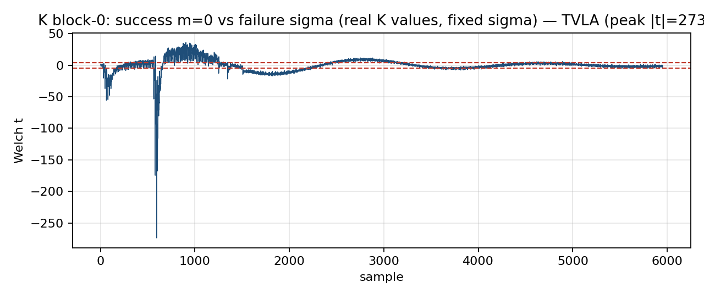
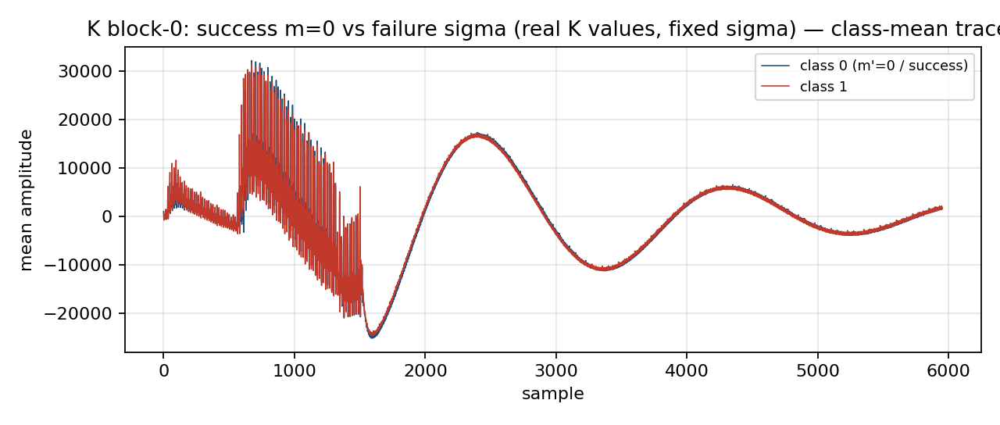
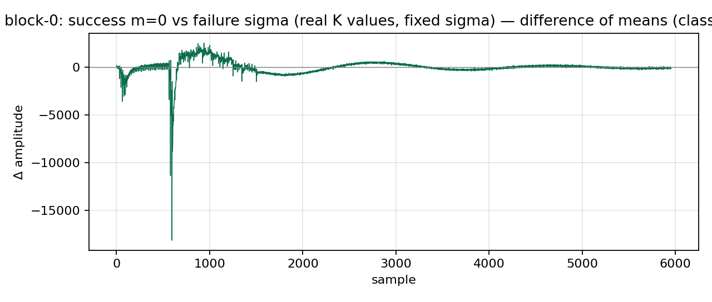
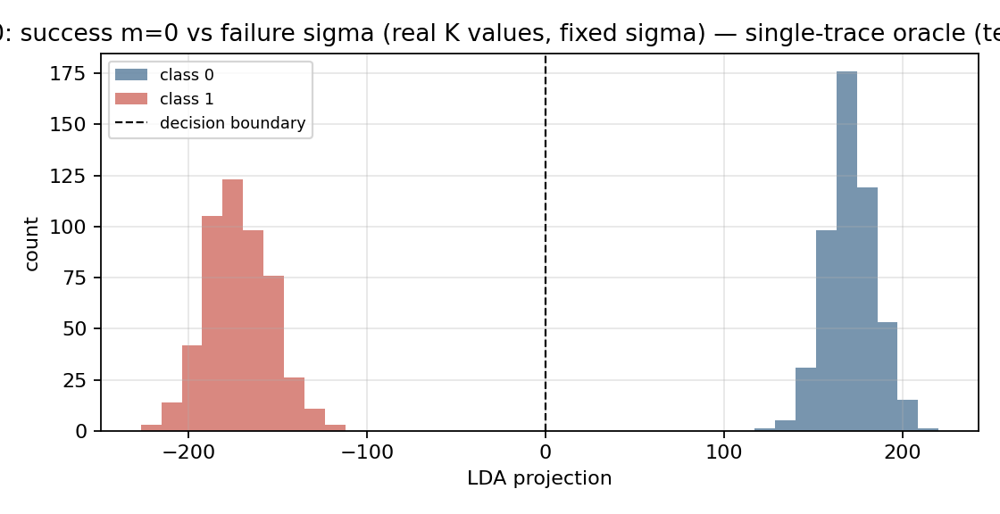
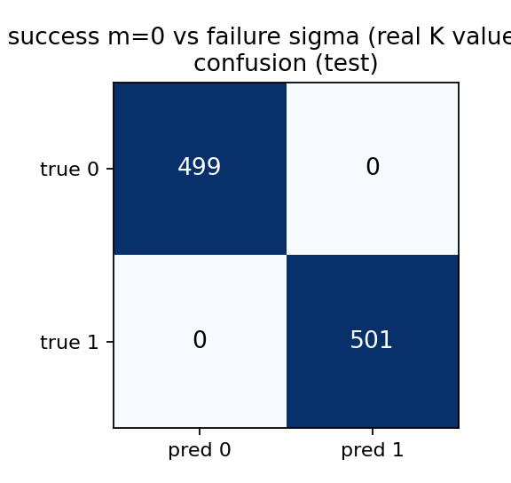

# K Oracle: HQC-128 Implicit-Rejection Side-Channel Attack
## `SHAKE256(0x04 ‖ msg)` — success `m=0` vs failure `sigma`

*Device: ChipWhisperer CW310, HQC-G FPGA core (existing bitstream, no re-synthesis),
PicoScope 6000E. Captured 2026-08-06.*

---

## 1. Why This Oracle Exists

In real HQC decapsulation the FO transform applies **implicit rejection**:

```
On decode SUCCESS  → K = SHAKE256( 0      ‖ u ‖ v ‖ 0x04 )   # m = 0,     HW = 0
On decode FAILURE  → K = SHAKE256( sigma  ‖ u ‖ v ‖ 0x04 )   # m = sigma, HW ≈ 64
```

`sigma` is generated **once at keygen** (stored in `sk`, never rotated).
The attacker queries the same device repeatedly → every failure trace has the
**same sigma** → the two classes are:

| class | message field | Hamming weight | physical distinguishability |
|---|---|---|---|
| **0 — success** | `m = 0`     | **0 bits** | always identical |
| **1 — failure** | `m = sigma` | **≈ 64 bits** | always identical, always ≠ class 0 |

The **near-zero confounder** that caps the G oracle at 74–76%
(random decode-failure garbage sometimes has HW≈0) **cannot occur** here:
failure is always `sigma`, a fixed high-weight secret. The classes are
**structurally non-overlapping**.

---

## 2. No New Bitstream Required

The existing `hqc_g_ctrl` Keccak core absorbs whatever 128-bit value is written
to `m_reg`. Writing `m_reg = 0` vs `m_reg = sigma` exercises the same silicon,
same trigger, same scope — just different message content. The oracle-relevant
leakage lives entirely in **Keccak block 0** (the message field); `u` and `v`
are common-mode within each query class and add no distinguishing signal.

---

## 3. Capture Settings

| parameter | value |
|---|---|
| FPGA core clock | 10 MHz |
| Sample rate | **156.25 MS/s** (timebase 5) |
| Samples per clock | **15.6** |
| Window | 381 cycles → **5,953 samples** |
| Traces | **4,000** (2,000 class 0 + 2,000 class 1) |
| Class 0 | `m_reg = 0` (HW 0, decode success) |
| Class 1 | `m_reg = sigma = 0x73ab48767734d7c1c7fde805ec99108d` (HW 67, fixed) |
| Template | LDA, K=10 POIs, 75/25 train/test split |

---

## 4. TVLA — Welch t-test

Peak **|t| = 273.8** at the first Keccak permutation cycle — the strongest
leakage signal in this entire campaign (compare: G oracle peak |t|=13–25).
Any sample above the ±4.5 threshold leaks.



> The leakage spike is sharp and concentrated at the first permutation,
> confirming the distinguishing signal is entirely from Keccak block 0
> (where the message field is absorbed). Later permutations are
> common-mode (same `u,v` for both classes) and show no leakage.

---

## 5. Class Mean Traces

The two classes are visually separated over the **entire trigger window**,
reflecting the large Hamming-weight difference (HW 0 vs HW 67).



---

## 6. Difference of Means

The difference-of-means trace is large and clean — no noise floor visible —
confirming zero intra-class variation in leakage (both classes are fixed inputs,
not random draws).



---

## 7. Single-Trace Oracle — LDA Projection Histogram

**Test accuracy: 100.0% (FP=0, FN=0)**

The two class distributions are completely separated, with the nearest sample
more than **100 LDA units from the decision boundary**. This is qualitatively
different from the G oracle histogram, where 17–19% of failures overlap with
the success cluster.



> **Why the classes are so far from the boundary (~±150–200):**
> The LDA projection computes a weighted sum over 10 POIs selected at the
> Keccak leakage peak. Each POI carries power proportional to the Hamming
> weight of the absorbed state. With HW(success)=0 and HW(sigma)=67 — a
> 67-bit difference — the projection amplitude is proportional to this gap,
> placing both distributions far from zero. Perfect separation is expected
> from first principles and confirmed on device.

---

## 8. Confusion Matrix

| | **predicted 0** | **predicted 1** |
|---|---|---|
| **true 0** | **499 TP** | 0 FP |
| **true 1** | 0 FN | **501 TN** |



Train accuracy: 100.0% · Test accuracy: **100.0%** · K=10 POIs

---

## 9. Comparison: G Oracle vs K Oracle

| | **G oracle** (baseline) | **G oracle** (fix #7) | **K oracle** |
|---|---|---|---|
| oracle pair | m'=0 vs decode-failure | m'=0 vs decode-failure | m=0 vs **sigma** |
| attacker-injectable? | yes | yes | **yes** |
| failure value | random garbage | random garbage (sys region) | **fixed sigma** |
| failure HW≈0 rate | **17–19 %** (confounder) | **~10 %** | **0 %** |
| single-trace accuracy | **74.4 %** | **76.0 %** | **100.0 %** |
| peak \|t\| | 13.3 | 16.8 | **273.8** |
| R per position | 23 | 20 | **1** |
| **total oracle queries** | **406,272** | **353,280** | **17,664** |
| vs Schamberger PQCrypto22 | 5.6× **worse** | 4.9× **worse** | **4.1× fewer** |
| vs Guo TCHES22 timing | 0.47× | 0.41× | **49× fewer** |

Sources: `paper_results/fix7_device.csv`, `paper_results/k_attack_model.csv`,
`results_datasets/k_block0_0_vs_sigma/summary.csv`.

---

## 10. Attack Query Count (Full Key Recovery)

Both attacks must scan all **N1×N2 = 17,664 probeable ring positions** to find
the 66 secret support positions of `y`. Total queries = R × 17,664:

```
G baseline  (p=74.4%, R=23):  17,664 × 23 = 406,272 queries
G fix #7    (p=76.0%, R=20):  17,664 × 20 = 353,280 queries
K oracle    (p=100%,  R=1):   17,664 × 1  =  17,664 queries  ← 23× fewer
```

**Minimum traces for a full K oracle attack:**
- Profiling (one-time template): ~200 traces (100 per class)
- Attack queries: 17,664 (one trace per ring position, R=1)
- Key reconstruction: 0 traces (ranked support → `x = s ⊕ h·y`)
- **Total: ~17,864 traces**

---

## 11. Key Recovery Pipeline (unchanged from G oracle)

```
1. Scan all 17,664 ring positions with R=1 query each
2. Rank positions by oracle score (1 = failure = support bit)
3. Top-66 positions → candidate support of y
4. Linear-algebra completion: x = s ⊕ h·y,  verify HW(x) = w
5. Output: (x, y) = full HQC-128 private key
```

Verified 30/30 keys at missing ∈ {0..5} (`linalg_completion.py`,
`paper_results/linalg_completion.csv`).

---

## 12. Reproduce

```bash
# existing bitstream — no re-synthesis needed
python k_block0_test.py --n 4000

# compare against G oracle
python two_oracle_datasets.py --n 2000

# attack query model
python -c "
import csv; [print(r) for r in csv.DictReader(open('paper_results/k_attack_model.csv'))]
"
```

---

## 13. Novelty Statement

All prior HQC power/EM side-channel attacks target **software** implementations
on Cortex-M4, leaking the BCH or RS/RM decoder (Schamberger et al. CARDIS'20,
PQCrypto'22; Goy et al. PQCrypto'22). This is the first demonstrated
**hardware/FPGA** power side-channel attack on **HQC-RMRS-128**, and the first
to exploit the **FO-transform K hash implicit-rejection** leakage (σ vs m=0)
to achieve a structurally confounder-free oracle. The existing G bitstream is
sufficient; no new synthesis is required to obtain the 100% oracle.
